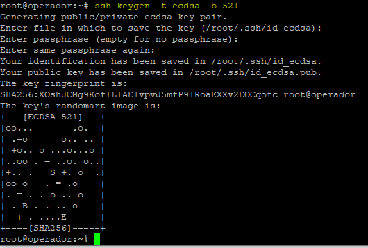
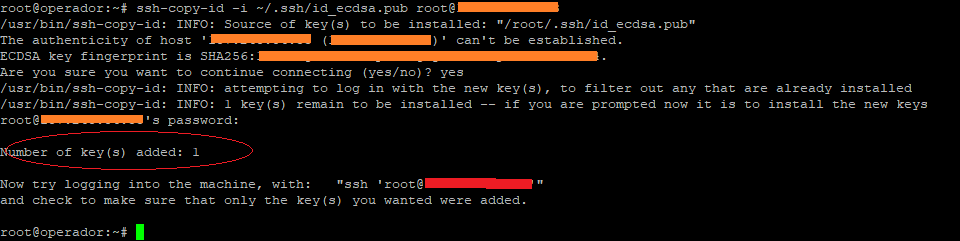
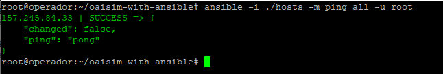

# oaisim-with-ansible
This project aims to build a playbook for implementing the elements that make up the [OpenAirInterface System Emulation](https://gitlab.eurecom.fr/oai/openairinterface5g/wikis/OpenAirLTEEmulation). To use the playbook you need the following elements:

1. A machine called 'operator's machine', running Linux and with a properly installed version of [Ansible](https://docs.ansible.com/). The next sections will present the steps for installing Ansible.
2. A machine for installing the eNB (and if applicable, to simulate the UE's).
3. One machine for installing the EPC core.

We assume that the <b>all machines are connected to the internet</b> and <i>see each other</i>.
## Installation Guide
The first thing to do, is configure the <i>operator machine</i>.

### Ansible Installation (Operator Machine)
Ansible's installation procedures depend on the inclusion of some repositories on the operator's machine. Depending on the distribution uses the commands for the inclusion of these repositories they can change, for more information see [this page](https://docs.ansible.com/ansible/latest/installation_guide/intro_installation.html#installing-the-control-node) . The next steps works to <b>linux Ubuntu 18.04+ LTS</b>. To add a new repository, run:
```
sudo apt-add-repository -y ppa:ansible/ansible-2.7
```
then, update the dependencies tree:
```
sudo apt-get update
```
and finally install Ansible with the following command:

```
sudo apt-get install ansible
```
After installation check if the installed version is 2.7 or higher using the following command:
```
ansible --version
```
the expected result should be equivalent to that shown in the image below:


### Check Ansible Connection (Operator Machine / enB Machine)
After installing ansible on the operator's machine, the next step is to configure the connection between the operator's machine and the other machines involved in the OpenAir deployment process. For the correct operation, Ansible needs to have full access to the other machines involved, this is done through the exchange of <i>SSHKeys</i> process:

Generate an ssh key from the operator's machine using the following command:
```
ssh-keygen -t ecdsa -b 521
```
I recommend that you use  <i>empty passphrase</i>, the result should be equivalent to that shown in the image below:


This key will be used by <i>Ansible</i> when running the deployment playbooks, so we must copy that key to the other machines involved in the process and ensure that it stays in the **root directory of the respective machines**. To copy the operator's machine key to the machine where enB will be deployed, use the following command:
```
ssh-copy-id -i ~/.ssh/id_ecdsa.pub <user>@<enB-host>
```
the result should be equivalent to that shown in the image below:


#### Test Ansible Connection (Operator Machine / enB Machine)

On the <i>operator's machine</i> it will be necessary to clone this project to test the connection throught <i>Ansible</i>. To be possible, it is necessary to have **GIT** properly installed. You can check this with the following command:
```
git --version
```
the expected result should be something similar to:
```
git version x.x.x
```  
if GIT is not installed, just run the following command:
```
sudo apt-get install git
```
 
 Then choose a directory and clone the **oaisim-with-ansible project**:
```
git clone https://github.com/ciromacedo/oaisim-with-ansible.git
```
after clone, access the project folder and open the **hosts** file with a text editor (Nano, Vi). The file content is similar to:
```
[enB]
<enB-IP-address>
```
replace the ```<enB-IP-address>``` for the IP address of the <i>enB Machine</i>. Save and close the file, and inside the project base directory run the next command:
```
ansible -i ./hosts -m ping all -u root
```
the expected result should be equivalent to that shown in the image below

 this means that everything is fine and that <i>Ansible</i> has full access to the <i>enB Machine</i>.
 

