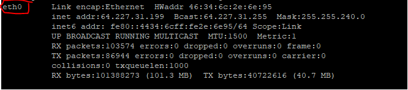

# OpenAirInterfaceSystemEmulation-with-ansible

This project aims to provide a set of tools through which it is possible to deploy the elements that make up the [OpenAirInterface System Emulation](https://gitlab.eurecom.fr/oai/openairinterface5g/wikis/OpenAirLTEEmulation) with the elements of [Free5GC](https://www.free5gc.org/) in a simple and automated way. For this, we break [OpenAirInterface System Emulation](https://gitlab.eurecom.fr/oai/openairinterface5g/wikis/OpenAirLTEEmulation) and [Free5GC](https://www.free5gc.org/) into smaller elements, and place each of these elements in a [_Docker Conteiners_.](https://hub.docker.com/u/laboraufg)  , like as illustrated by the following image.
<p align="center">
     
</p>

Elements of [OpenAirInterface System Emulation](https://gitlab.eurecom.fr/oai/openairinterface5g/wikis/OpenAirLTEEmulation) (UE and enB) can be executed without Free5GC, but the internet connection test presented in [this project](https://github.com/LABORA-INF-UFG/oaisim-free5gc-install#4---testing-user-equipments-ue-internet-connection) will only be executed correctly with all elements instaled.

To use the playbook we consider two possible scenarios: in the first you will need the following elements.

1. A machine called _operator's machine_, running Linux and with a properly installed version of [Ansible](https://docs.ansible.com/). In the [following sections](https://github.com/LABORA-INF-UFG/oaisim-free5gc-install#1---ansible-installation--configuration-operator-machine) we will present the steps for installing Ansible.
2. Deployment environment machine (it's can be _VM's_ or _PC Bare Metal_) for installing the Free5G and [OpenAirInterface System Emulation](https://gitlab.eurecom.fr/oai/openairinterface5g/wikis/OpenAirLTEEmulation) elements.

The minimum hardware requirements are described in the figure below, we assume that the <b>all machines are connected to the internet</b> and <i>see each other</i>.
<p align="center">
     
</p>

In the second scenario, the playbook will be executed on the deployment environment, in other words, only one machine will be necessary, and the minimum hardware requirements are described in the figure below.
<p align="center">
     
</p>

# Installation Guide
The first thing to do, is configure the <i>operator machine</i>.

## 1 - Ansible Installation / Configuration (Operator Machine)
Ansible's installation procedures depend on the inclusion of some repositories on the operator's machine. Depending on the distribution uses the commands for the inclusion of these repositories they can change, for more information see [this page](https://docs.ansible.com/ansible/latest/installation_guide/intro_installation.html#installing-the-control-node) . The next steps works to <b>linux Ubuntu 16.04.x LTS</b>. To add a new repository, run:
```
sudo apt-add-repository -y ppa:ansible/ansible-2.7
```
then, update the dependencies tree:
```
sudo apt-get update
```
and finally install Ansible with the following command:

```
sudo apt-get install ansible
```
After installation check if the installed version is 2.7 or higher using the following command:
```
ansible --version
```
The expected result should be equivalent to that shown in the image below:
<p align="center">
     
</p>


### Access Settings (Operator Machine / Deployment Environment Machine)
After installing ansible on the operator's machine, the next step is to configure the connection between the operator's machine and the other machines involved in the [OpenAirInterface System Emulation](https://gitlab.eurecom.fr/oai/openairinterface5g/wikis/OpenAirLTEEmulation) deployment process. For the correct operation, Ansible needs to have full access to the other machines involved, this is done through the exchange of <i>SSHKeys</i> process:

Generate an ssh key from the operator's machine using the following command:
```
ssh-keygen -t ecdsa -b 521
```
I recommend that you use  <i>empty passphrase</i>, the result should be equivalent to that shown in the image below:
<p align="center">
     
</p>

This key will be used by <i>Ansible</i> when running the deployment playbooks, so we must copy that key to the other machines involved in the process and ensure that it stays in the **root directory of the respective machines**. To copy the operator's machine key to the machine where _OpenAirInterface+Free5gc_ will be deployed, use the following command:
```
ssh-copy-id -i ~/.ssh/id_ecdsa.pub <user>@<deployment-environment-host>
```
the result should be equivalent to that shown in the image below:
<p align="center">
     
</p>

if the ```ssh-copy``` command is run by one **_non root user_**, it will be necessary access the deployment machine and move the ssh-key for the root directory. It can be executed by the following command ```sudo cp -r .ssh/authorized_keys /root/.ssh/```.

After copy ssh key, access the deployment machine ``` ssh <user>@<deployment-environment-host> ``` and run the following commands:
```
 apt install python-minimal -y
```
the last command install **python minimal**. This package contains the interpreter and some essential modules. It is used by Ansible for same basic tasks.

After install <i>python minimal</i> into _deployment environment machine_, we need get the name of **physical network interface** of the deployment machine. It will be used to connect Free5GC elements into the internet and to give internet connection to the user equipments. To do this, run ```ifconfig``` into deployment machine and take note the **_physical network interface name_** display in the next figure.
<p align="center">
     
</p>
this information will be necessary when executing the deployment playbook.

#### Test Ansible Connection (Operator Machine / Deployment Environment Machine)

On the <i>operator's machine</i> it will be necessary to clone this project to test the connection throught <i>Ansible</i>. To be possible, it is necessary to have **GIT** properly installed. You can check this with the following command:
```
git --version
```
the expected result should be something similar to:
```
git version x.x.x
```  
if GIT is not installed, just run the following command:
```
sudo apt-get install git
```
 
 Then choose a directory and clone the **oaisim-with-ansible project**:
```
git clone https://github.com/LABORA-INF-UFG/oaisim-free5gc-install.git
```
after clone, access the project folder and open the **hosts** file with a text editor (Nano, Vi). The file content is similar to:
```
[OAISim-with-free5gc]
<deployment-environment-IP-address>
```
replace the ```<deployment-environment-IP-address>``` for the IP address of the <i>deployment environment machine</i> (if you using the second scenario, as described in [figure 2](https://github.com/LABORA-INF-UFG/oaisim-free5gc-install/blob/master/images/environment_description_2.png), the ```<deployment-environment-IP-address>``` will be that of your local machine). Save and close the file, and inside the project base directory run the next command:
```
ansible -i ./hosts -m ping all -u root
```
the expected result should be equivalent to that shown in the image below:
<p align="center">
     
</p>

this means that everything is fine and that <i>Ansible</i> has full access to the <i>deployment machine</i>.
 
## 2 - Run Ansible Playbook (Free5G + OpenAirInterface Install)
 After configuration steps, just run the next command.
```
ansible-playbook    Deploy5GC.yml  -i  hosts -e "physical_network_interface=<< physical network interface name>>"
```
It will be start the process of deployment the elements of **OpenAirInterface + Free5GC**. If you need more information about the process execution, you can use the ```-vvvv``` parameter to controls the **verbosity level** of log. This parameter can be adjusted in five diferent levels (```-v```, ```-vv```, ```-vvv``` or ```-vvvv```). 

One of the objectives of this project is to automate steps for setting up the _test environment_ involving OAISIm + free5GC. The configuration steps can be difficult and can lead to several problems, for this reason, we automate the construction of the following configuration files: 
1. ```rcc.band7.tm1.nfapi.conf``` - contains information about connection parameters between eNB and AMF, in addition to information about the network environment (_physical network interface_, IP container address).
2. ```ue.nfapi.conf``` - contains connection parameters between eNB and UE.
3. ```ue_eurecom_test_sfr.conf``` - contains all the information about UE's that will be used in the simulation process. This information is the same information that will be inserted in MONGODB and displayed in [Web User Interface.](https://github.com/LABORA-INF-UFG/oaisim-free5gc-install/raw/master/images/web_ui_dashboard.png)
4. ```free5gc.conf``` - contains connection parameters information between each free5GC container and _MONGODB_ container, information about log level produced by each free5GC containers and _ip address_ of each containers.
5. ```amf.conf``` - contains _ip address_ information of AMF container and connection parameters information between AMF container and HSS container.
6. ```smf.conf``` - contains _ip address_ information of SMF container and connection parameters information between SMF container and PCRF container.
7. ```hss.conf``` - contains _ip address_ information of HSS container and connection parameters information between HSS container and AMF container.
8. ```pcrf.conf``` - contains _ip address_ information of PCRF container and connection parameters information between HSS container and SMF container.

All this configuration files is built dynamically by _Ansible_ and all of parameters values can be changed through command line. In the [following sections](https://github.com/LABORA-INF-UFG/oaisim-free5gc-install/blob/master/README.md#5---configuration-parameters) we presents a complete list of configuration parameters.
  

## 3 - Running and testing
After finish installation for default, **MongoDB** and **Web User Interface** is initialized. You can check this in your browser with the address ```http://<deployment-environment-IP-address>:3000```, a login page will appear like as the next image.
<p align="center">
     
</p>

The Web Application access port can be changed through the parameter ```web_application_access_port```, the default value is _3000_. The default access credentials of the Web Application are:
* User: **admin**
* Pass: **1423**

After accessing WebUI, check in main page the existence of UEs registered,  the result should be equivalent to that shown in the next figure:
<p align="center">
     
</p>

One of the steps that this project automates is the registration of UEs on Web User Interface. By default, _ansible playbook_ adds 10 Ue's, however, this number can be expanded up to a maximum of 200 Ue's. To do this, just use the parameter ``` num_ues_init_database='N' ``` before or after the parameter ``` physical_network_interface=<< physical network interface name>> ```, replacing ```N``` by the number of UEs to be registered as described in [section 2.](https://github.com/LABORA-INF-UFG/oaisim-free5gc-install#2---run-ansible-playbook-free5g--openairsim-install) In parallel to this, _ansible playbook_ also registers all UE's added in Web User Interface in the respective configuration file ```ue.nfapi.conf``` inside in UE element. For more details, check the [check the parameters installation description section.](https://github.com/LABORA-INF-UFG/oaisim-free5gc-install/blob/master/README.md#num_ues_init_database)

If you access the deployment machine and type ```docker ps```, you can see that all the elements ar running, the result should be equivalent to that shown in the next figure:
<p align="center">
     
</p>

Now, we will __run__ all the elements, for this, access the deployment machine with 7 different terminal's and in each terminal run the follow steps.

### 3.1 - Running Free5GC components

The first elements that will be started is [Free5GC](https://www.free5gc.org/) components. This step can be automated through the parameter ```init_free5gc_elements_simulation```, if you want run the deployment process and at the same time, start all [Free5GC](https://www.free5gc.org/) simulation process elements, you could use the parameter ```init_free5gc_elements_simulation='true'```. If you decide use this strategy, the log information about of each [Free5GC](https://www.free5gc.org/) element will no be displayed on terminal. The log information are recorded in the file ```/root/free5gc-stage-1/install/var/log/free5gc/free5gc.log``` inside each Free5GC container. For more details, check the [check the parameters installation description section.](https://github.com/LABORA-INF-UFG/oaisim-free5gc-install/blob/master/README.md#num_ues_init_database)

### Running AMF
Access the _first terminal_ and and run the following commands:
```
docker exec -ti amf bash
/root/free5gc-stage-1/install/bin/free5gc-amfd
```
the result should be equivalent to that shown in the next figure:
<p align="center">
     
</p>

### Running UPF
Access the _secound terminal_ and and run the following commands:
```
docker exec -ti upf bash
/root/free5gc-stage-1/install/bin/free5gc-upfd
```
the result should be equivalent to that shown in the next figure:
<p align="center">
     
</p>

### Running SMF
Access the _third terminal_ and and run the following commands:
```
docker exec -ti smf bash
/root/free5gc-stage-1/install/bin/free5gc-smfd
```
the result should be equivalent to that shown in the next figure:
<p align="center">
     
</p>

the green mark in the figure, represents the _UPF Association Response_ container reaction when SMF is initialized.

### Running HSS
Access the _fourth terminal_ and and run the following commands:
```
docker exec -ti hss bash
/root/free5gc-stage-1/install/bin/nextepc-hssd 
```
the result should be equivalent to that shown in the next figure:
<p align="center">
     
</p>


the green mark in the figure, represents the _AMF Connection_ container reaction when HSS is initialized.

### Running PCRF
Access the _fifth terminal_ and and run the following commands:
```
docker exec -ti pcrf bash
/root/free5gc-stage-1/install/bin/nextepc-pcrfd 
```
the result should be equivalent to that shown in the next figure:
<p align="center">
     
</p>


the green mark in the figure, represents the _SMF Connection_ container reaction when PCRF is initialized.


### 3.2 - Running OpenAirInterface components
So far all the elements of the _free5gC_ have been initialized, the next will be elements of the _OpenAirInterface_.

### Running enB
Access the _sixth terminal_ and and run the following commands:
```
docker exec -ti enb bash
cd /root/enb/cmake_targets/ran_build/build
sudo -E ./lte-softmodem -O /root/enb/ci-scripts/conf_files/rcc.band7.tm1.nfapi.conf 
```
the result should be equivalent to that shown in the next figure:
<p align="center">
     
</p>

The _enB_ terminal will be in constant loop displaying the next message ``` Waiting fo PHY_config_req```. The green mark in the figure, represents the _AMF enB Registration_ container reaction when enB is initialized.

### Running UE
Access the _seventh terminal_ and and run the following commands:
```
docker exec -ti ue bash
cd /root/ue/cmake_targets/ran_build/build
./lte-uesoftmodem -O /root/ue/ci-scripts/conf_files/ue.nfapi.conf --L2-emul 3 --num-ues 1 --nums_ue_thread 1 --nokrnmod 1
```
the result should be equivalent to that shown in the next figure:
<p align="center">
     
</p>
The alert messages are not relevant.

## 4 - Testing User Equipments (UE) Internet Connection
Now we can test the UE internet connection. For this, access the deployment machine and type ``` docker exec -ti ue bash ``` to access de UE Container. Inside the container type ```ifconfig``` to check network interface. The result should be equivalent to that shown in the next figure:
<p align="center">
     
</p>

Now type ``` ping google.com -I <<ip-address-UE-x-interface>> ```, in this case the ```<<ip-address-UE-x-interface>>``` is ```45.45.0.2```, so the test is: ``` ping google.com -I 45.45.0.2 ```. The result should be equivalent to that shown in the next figure:
<p align="center">
     
</p>

The presented results demonstrate that the _UE_ establish an internet connection. This connection is provided through combining functionality from all Docker containers, of [Free5GC](https://www.free5gc.org/) components and [OpenAirInterface System Emulation](https://gitlab.eurecom.fr/oai/openairinterface5g/wikis/OpenAirLTEEmulation) components.

## 5 - Configuration parameters
Below we will present a list containing the available configuration parameters, their importance and the default values.

#### num_ues_init_database
This parameter represents the number of UEs that will be pre-configured during the deployment process. The numeric value set in this parameter, represents the number of _User Equipments_ that will be added into MONGODB container and append into ```ue_eurecom_test_sfr.conf``` configuration file, located into ```UE_folder_name/openair3/NAS/TOOLS/``` into UE container. If you not inform anything the default value used is **100**, the maximum value accepted is **200**. For this tutorial we limited this number in 10 devices.

#### web_application_access_port
This parameter represents the access port of Web Application. The default value used is **3000**. 

#### deploy_oaisim
This is control parameter of deployment [OpenAirInterface System Emulation](https://gitlab.eurecom.fr/oai/openairinterface5g/wikis/OpenAirLTEEmulation). If you want to deploy only [Free5GC](https://www.free5gc.org/) components, you can cheange the parameter value to ```deploy_oaisim='false'```. The default value used is **true**. 

#### deploy_free5gc
This is control parameter of deployment Free5GC. If you want to deploy only [OpenAirInterface System Emulation](https://gitlab.eurecom.fr/oai/openairinterface5g/wikis/OpenAirLTEEmulation) components, you can cheange the parameter value to ```deploy_free5gc='false'```. The default value used is **true**.  It's important you know that if you install only _OpenAirInterface System Emulation_ components and do not install _Free5GC_, the presented test in [before sections](https://github.com/LABORA-INF-UFG/oaisim-free5gc-install/blob/master/README.md#4---testing-user-equipments-ue-internet-connection) do not works, in other words, the UEs can not access the internet.

#### init_free5gc_elements_simulation
This is a control parameter of [Free5GC](https://www.free5gc.org/) process simulation start. The default value is **false**, if you decide set this parameter with **true** in deployment process, the steps described into [section 3.1](https://github.com/LABORA-INF-UFG/oaisim-free5gc-install#31---running-free5gc-components) not be necessary and all log information produces by Free5GC container elements will by directed for ```/root/free5gc-stage-1/install/var/log/free5gc/free5gc.log``` file inside respective container.