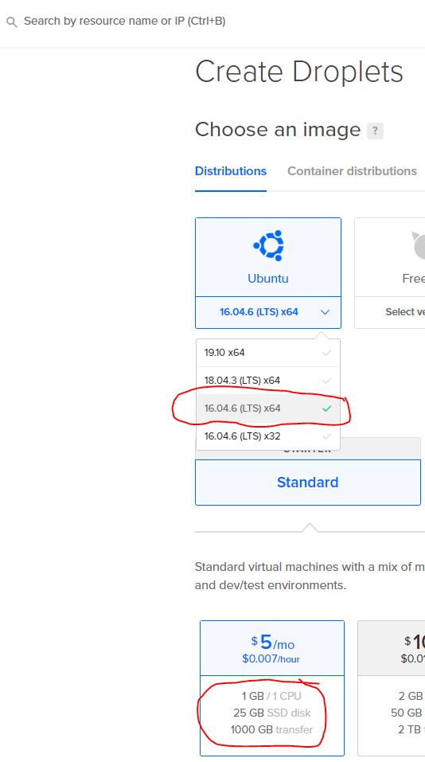

# oaisim-with-ansible
This project aims to build a playbook for implementing the elements that make up the [OpenAirInterface System Emulation](https://gitlab.eurecom.fr/oai/openairinterface5g/wikis/OpenAirLTEEmulation). To use the playbook you need the following elements:

1. A machine called 'operator's machine', running Linux and with a properly installed version of [Ansible](https://docs.ansible.com/). The next sections will present the steps for installing Ansible.
2. A machine for installing the eNB (and if applicable, to simulate the UE's) - **Ubuntu 16.04.x**.
3. One machine for installing the CORE (EPC or Free5G).

We assume that the <b>all machines are connected to the internet</b> and <i>see each other</i>.
## Installation Guide
The first thing to do, is configure the <i>operator machine</i>.

### 1 - Ansible Installation / Configuration (Operator Machine)
Ansible's installation procedures depend on the inclusion of some repositories on the operator's machine. Depending on the distribution uses the commands for the inclusion of these repositories they can change, for more information see [this page](https://docs.ansible.com/ansible/latest/installation_guide/intro_installation.html#installing-the-control-node) . The next steps works to <b>linux Ubuntu 16.04.x LTS</b>. To add a new repository, run:
```
sudo apt-add-repository -y ppa:ansible/ansible-2.7
```
then, update the dependencies tree:
```
sudo apt-get update
```
and finally install Ansible with the following command:

```
sudo apt-get install ansible
```
After installation check if the installed version is 2.7 or higher using the following command:
```
ansible --version
```
the expected result should be equivalent to that shown in the image below:


### Access Settings (Operator Machine / enB Machine)
After installing ansible on the operator's machine, the next step is to configure the connection between the operator's machine and the other machines involved in the OpenAir deployment process. For the correct operation, Ansible needs to have full access to the other machines involved, this is done through the exchange of <i>SSHKeys</i> process:

Generate an ssh key from the operator's machine using the following command:
```
ssh-keygen -t ecdsa -b 521
```
I recommend that you use  <i>empty passphrase</i>, the result should be equivalent to that shown in the image below:


This key will be used by <i>Ansible</i> when running the deployment playbooks, so we must copy that key to the other machines involved in the process and ensure that it stays in the **root directory of the respective machines**. To copy the operator's machine key to the machine where enB will be deployed, use the following command:
```
ssh-copy-id -i ~/.ssh/id_ecdsa.pub <user>@<enB-host>
```
the result should be equivalent to that shown in the image below:


after copy ssh key, access the enb machine ``` ssh <user>@<enB-host> ``` and run the following commands:
```
 apt install python-minimal -y
```
the last command install **python minimal**. This package contains the interpreter and some essential modules. It is used by Ansible for same basic tasks.

After install <i>python minimal</i>, we need get some information about **physical network interface** of the machine. To do this, run ```ifconfig``` and take note the **_physical network interface name_** display in the next figure.

this information will be necessary when executing the deployment playbook.

#### Test Ansible Connection (Operator Machine / enB Machine)

On the <i>operator's machine</i> it will be necessary to clone this project to test the connection throught <i>Ansible</i>. To be possible, it is necessary to have **GIT** properly installed. You can check this with the following command:
```
git --version
```
the expected result should be something similar to:
```
git version x.x.x
```  
if GIT is not installed, just run the following command:
```
sudo apt-get install git
```
 
 Then choose a directory and clone the **oaisim-with-ansible project**:
```
git clone https://github.com/ciromacedo/oaisim-with-ansible.git
```
after clone, access the project folder and open the **hosts** file with a text editor (Nano, Vi). The file content is similar to:
```
[oaisim-RAM]
<RAM-IP-address>
```
replace the ```<RAM-IP-address>``` for the IP address of the <i>enB/Ue's Machine</i>. Save and close the file, and inside the project base directory run the next command:
```
ansible -i ./hosts -m ping all -u root
```
the expected result should be equivalent to that shown in the image below

 this means that everything is fine and that <i>Ansible</i> has full access to the <i>enB Machine</i>.
 
 ### 2 - Lowlatency configuration
 Officially, the [OpenAirInterface](https://gitlab.eurecom.fr/oai/openairinterface5g/wikis/OpenAirLTEEmulation) deployment is not recommended on VM's ( [see this](https://gitlab.eurecom.fr/oai/openairinterface5g/wikis/OpenAirKernelMainSetup#virtual-machine-vmware-virtual-box-etc) ), however, we deploy it in [DigitalCoean](https://www.digitalocean.com/) environment with successful
 #### DigitalOcean environment
 It is necessary to have an DigitalOcean account, access the control panel and create a simple Droplet as shown below:
 
 
 - Ubuntu 16.04.6(LTS) x64
 - 1GB / 1 CPU (cheapest)
 
 After create a Droplet, access th VM with ``` ssh ``` and run the following commands:
 ```
 sudo apt update
 sudo apt-get  -y install linux-image-lowlatency linux-headers-lowlatency
 ```
 The command install the lowlatency kernel version. For security reasons the DigitalOcean VM interface will display a boot menu, like display in the next figure:
  
  
choose the option ``` keep the local version currently installed ``` and wait, after system initialization, you should be restart the machine.

After initialization, type ``` uname -r ```. The expected result should be identical to:

 ```
 4.4.0-177-lowlatency
 ```

 ### 3 - Run Ansible Playbook (RAM Install)
 After configuration steps, just run the next command.
```
ansible-playbook   -vvvv   build_RAM.yml  -i  hosts -e "physical_network_interface=<< physical network interface name>> build_with_dependecies=true num_ues=10 core_installation_ip_address=<< replace this with the CORE installation ip address >> config_vm=true"
```
it will be start the process of deployment the elements of **enB/Ue's**. The ```-vvvv``` parameter controls the **verbosity level of log** and can be adjusted (```-v```, ```-vv```, ```-vvv``` or ```-vvvv```). The parameter ``` -e ``` enables the possibility of passing custom parameters to playbook, in this case, we need to pass **_the physical network interface name_** ``` "physical_network_interface=eth0" ```, **num_ues**, **core_installation_ip_address** and **config_vm**.
### 4 - Test RAM instalation

After running the playbook, access the target machine and acess root directory. Type ``` ls ``` and check for ``` ansible_ue ``` and ```ansible_enB``` directories. Access ``` /root/ansible_ue/openairinterface5g/cmake_targets/lte_build_oai/build ``` and run the following command:
```
./lte-uesoftmodem -O /root/ansible_ue/openairinterface5g/ci-scripts/conf_files/ue.nfapi.conf --L2-emul 3 --num-ues 1
```
the expected result is similar display in the next figure:
  
  
 ### 5 - Run Ansible Playbook (Free5G Install)
 After configuration steps, just run the next command.
```
ansible-playbook   -vvvv   build_free5GC.yml  -i  hosts -e "physical_network_interface=<< physical network interface name>>"
```
it will be start the process of deployment the elements of **enB/Ue's**. The ```-vvvv``` parameter controls the **verbosity level of log** and can be adjusted (```-v```, ```-vv```, ```-vvv``` or ```-vvvv```).

### 6 - Execution
Star enB:
```
sudo -E ./lte_build_oai/build/lte-softmodem -O ../ci-scripts/conf_files/rcc.band7.tm1.nfapi.conf
```

Star UE's:
```
./lte-uesoftmodem -O /root/ansible_ue/openairinterface5g/ci-scripts/conf_files/ue.nfapi.conf --L2-emul 3 --num-ues 1
```
